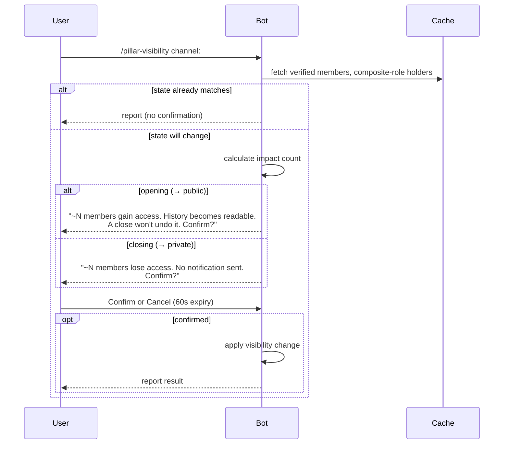

supplements: the confirmation flow and guard logic



supplements: the batch form confirmation

```text
/pillar-visibility channel:all visibility:private

→ One confirmation prompt:

  "Close 7 channels to private?
   #alpha: ~42 members lose access
   #beta: ~18 members lose access
   #gamma: ~5 members lose access
   
   They get no notification. Confirm?"
   
   [Confirm] [Cancel] — expires in 60s
```