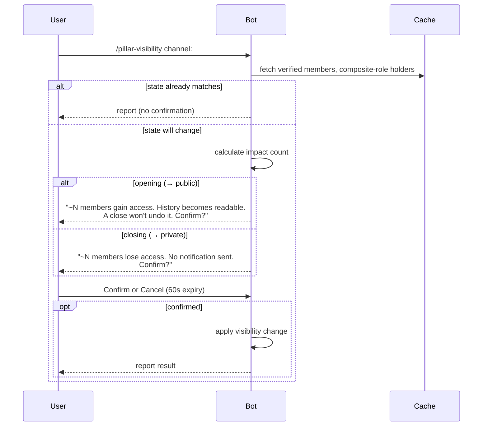

Decision 4 is recorded: each list line shows a badge with both states labeled.

---

**Q5 — Confirmation: which directions confirm, and what do they say?**

The two directions carry different risks, both already decided:

- **Open (→ public):** all verified members gain read access to the full message history at once. A later close does not take that back — people read it while open. Ticket #109 asked whether the open path warns about this.
- **Close (→ private):** every verified member without the composite role loses the channel immediately. Auto-grant (#111) protected people who posted. Pure readers lose it with no message. The ticket asks if the command names how many.

The code gives you both counts for free. The bot caches all members in the gateway. `/pillar-list` already counts role holders from that cache:

- Open: verified members who gain access = verified count minus composite-role count.
- Close: members who lose access = the same number.

Why confirm:

- A confirmation step stops a typo. `visibility` is one field on one command — `public` and `private` are one click apart.
- Skip the confirmation if the state already matches. No transition means nothing to confirm. The command just reports and fixes drift if it finds any.
- The batch form (Q2) confirms once for all channels, not once per channel.

**My recommendation: confirm both directions with Confirm/Cancel buttons, and show the count in each.**

- Open: "This makes the full message history of #x readable by ~N verified members. A later close does not undo that. Continue?"
- Close: "~N verified members lose access to #x. They get no notification. Continue?"
- No confirmation when the state already matches — the command only reports and repairs drift if needed.
- One confirmation covers the entire batch, with the channel list in the prompt.
- Buttons expire after 60 seconds. Expiry cancels the action.

Here's the flow:



For the batch form:

```
/pillar-visibility channel:all visibility:private

→ One confirmation prompt:

  "Close 7 channels to private?
   #alpha: ~42 members lose access
   #beta: ~18 members lose access
   #gamma: ~5 members lose access
   
   They get no notification. Confirm?"
   
   [Confirm] [Cancel] — expires in 60s
```

Do you agree?