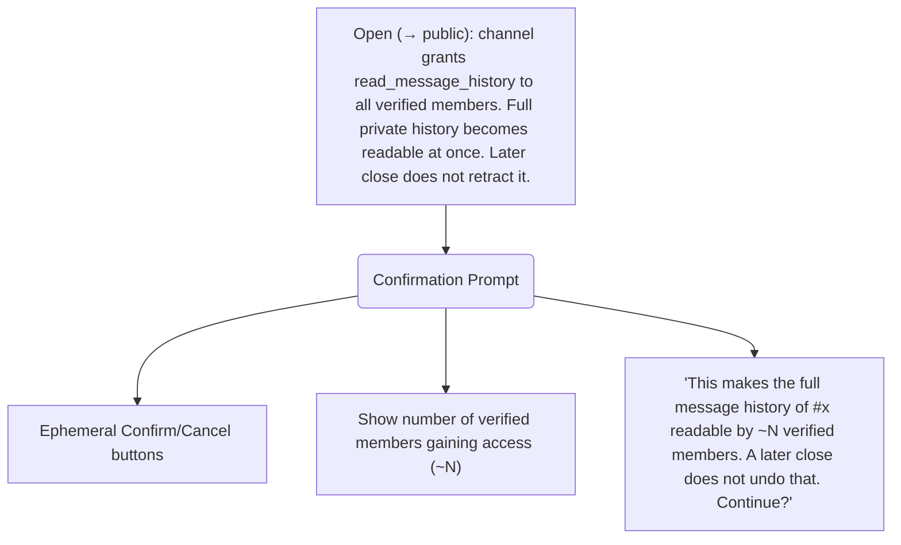
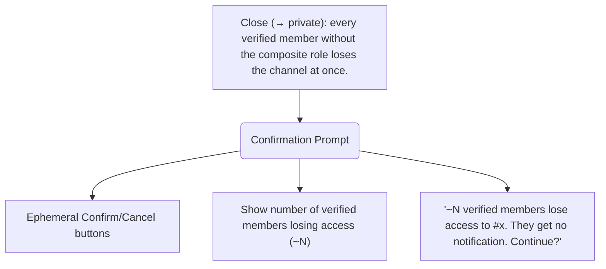
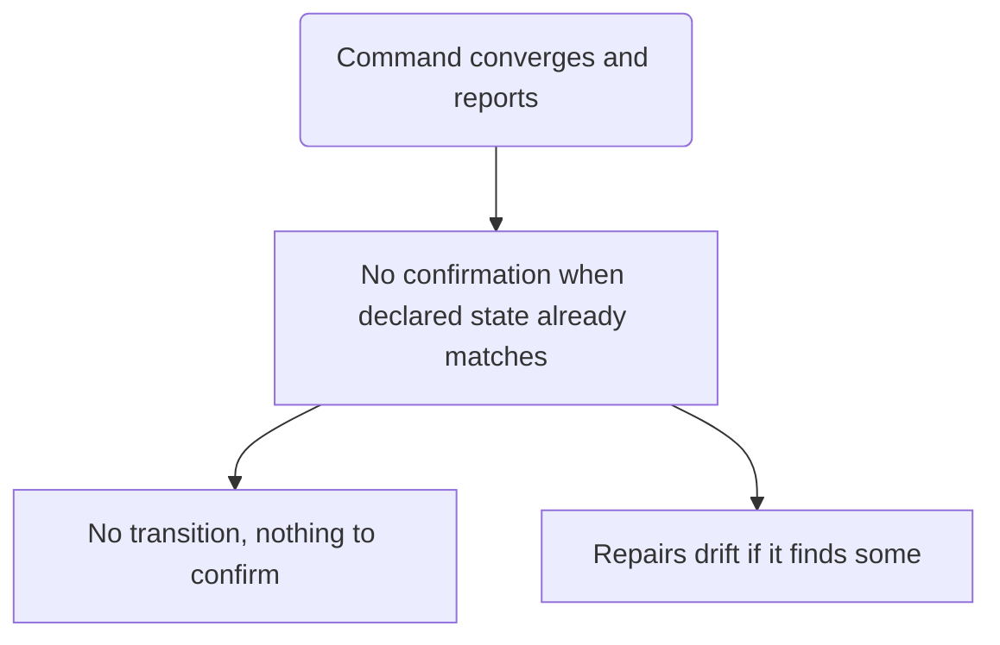
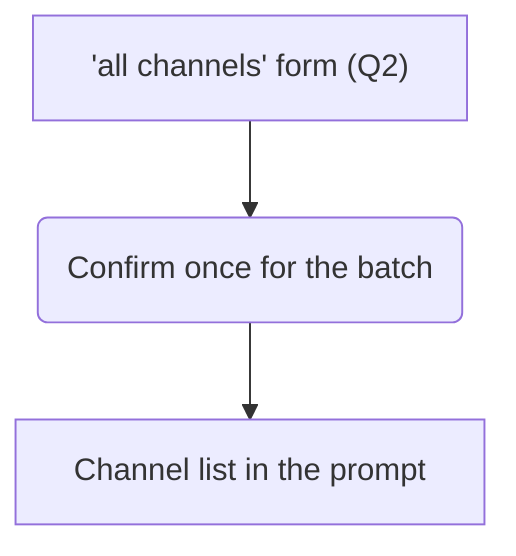
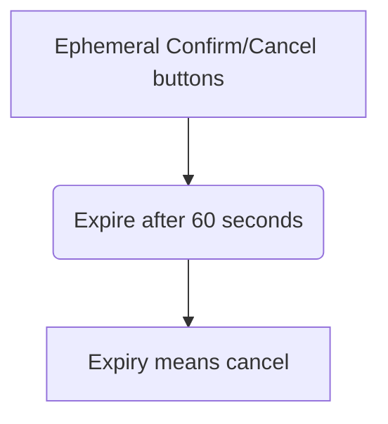

Confirmation prompt for opening a channel
<fence>

</fence>

Confirmation prompt for closing a channel
<fence>

</fence>

No confirmation when state matches
<fence>

</fence>

Confirmation for batch form
<fence>

</fence>

Button expiry
<fence>

</fence>