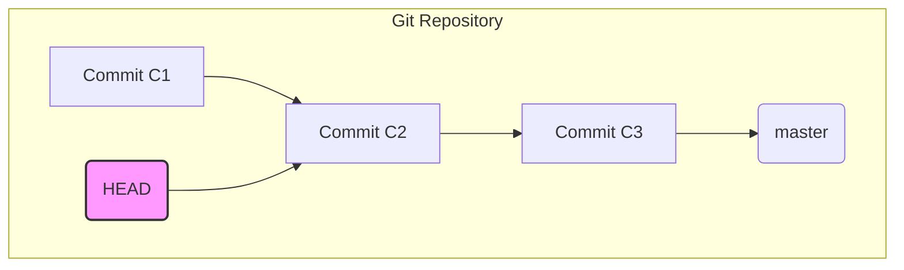
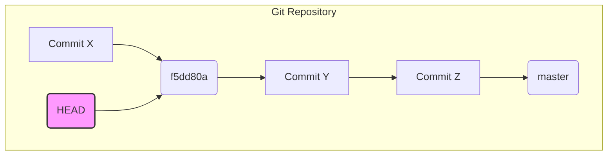

The user wants to visualize the provided text. I need to identify parts of the text that can be better represented by a diagram than by prose.

Here's a breakdown of the text and potential visualizations:

1.  **"Your main checkout sits on a detached HEAD at the old master tip (`f5dd80a`), so a plain `git pull` will not work as-is."**
    *   This describes a Git state. A diagram showing a detached HEAD pointing to a commit, with the `master` branch pointer elsewhere, would be illustrative.

2.  **"Run: `cd ~/projects/toolkit` `git switch master` `git pull`"**
    *   This is a sequence of commands. A pseudocode block or a simple flow diagram could represent this.

3.  **"Notes on what this touches: You have a small local edit (2 lines) in `prototypes/lanes-board.html` and an untracked `CONTEXT.md`. Both are safe: the merge only changed `src/` and `README.md`, so the switch and pull carry them over without conflict."**
    *   This describes file states and merge behavior. A shallow file tree showing the relevant files and their states (modified, untracked) could be useful. The note about safety and no conflict is important context.

4.  **"No `bun install` is needed — the merge added no dependencies. There is no build step, so the next `bun src/sync.ts` run (or `--watch`) uses the new lanes-board code immediately."**
    *   This explains dependencies and build steps. A component tree showing the relationship between `bun src/sync.ts` and the code it uses, highlighting the absence of `bun install` and a build step, could be effective.

5.  **"After that, a sync pass against a live map gives you the first real `lanes #<n>` tab. If you type `! cd ~/projects/toolkit && git switch master && git pull` in the prompt, the update runs right here and I can see the result."**
    *   This describes a subsequent action and its effect. It's more narrative and less about structure or algorithm, so a diagram might not add much clarity here.

Let's focus on the Git state and the command sequence, as these are the most concrete and visually representable parts.

**Visualization Plan:**

1.  **Git State:** A diagram showing a detached HEAD.
2.  **Command Sequence:** Pseudocode for the Git commands.
3.  **File Changes/Safety:** A shallow file tree.
4.  **Build/Dependency:** A component tree or pseudocode.

Considering the prompt "Pick the smallest view that makes a point clear," I will prioritize the Git state and the command sequence. The file safety and dependency notes are important context but might be too detailed for a single, clear diagram if combined with the Git state. I'll try to represent the Git state and the commands.

Let's refine:
The core problem is the "detached HEAD" and the solution is the sequence of commands. The notes explain *why* the commands work and what the outcome is.

I'll start with the Git state.

**Git State:**
The text describes a detached HEAD at `f5dd80a` which is the "old master tip". This means the `HEAD` is pointing directly to a commit, and the `master` branch pointer is somewhere else (presumably behind or at that commit).

```
HEAD -> f5dd80a (old master tip)
master -> f5dd80a (or behind)
```
This is a bit abstract. A more common way to show this is:
`master` branch is at commit X.
`HEAD` is detached and pointing to commit X.

Let's try to represent the state *before* the commands.

```
(commit A) -- (commit B) -- (commit C) <-- master
                               ^
                               |
                              HEAD
```
This shows `HEAD` is detached at commit C, which is also the tip of `master`. The text says "old master tip", implying `master` might have moved on. Let's assume `master` is *behind* the detached HEAD.

```
(commit A) -- (commit B) <-- master
                 ^
                 |
                HEAD (f5dd80a)
```
This seems more aligned with "detached HEAD at the old master tip".

**Command Sequence:**
The commands are:
1.  `cd ~/projects/toolkit`
2.  `git switch master`
3.  `git pull`

This is a straightforward sequence. Pseudocode is appropriate.

**File Safety:**
"small local edit (2 lines) in `prototypes/lanes-board.html` and an untracked `CONTEXT.md`. Both are safe: the merge only changed `src/` and `README.md`"
This implies a file tree structure.

```
~/projects/toolkit/
├── prototypes/
│   └── lanes-board.html  (modified)
├── src/                  (changed by merge)
│   └── ...
├── README.md             (changed by merge)
└── CONTEXT.md            (untracked)
```
This shows the files mentioned and their states.

**Dependency/Build:**
"No `bun install` is needed — the merge added no dependencies. There is no build step, so the next `bun src/sync.ts` run (or `--watch`) uses the new lanes-board code immediately."
This is a statement about the process. A component tree could show `bun src/sync.ts` depending on `src/` and `prototypes/lanes-board.html`, and explicitly *not* depending on a build step or `bun install`.

Let's try to combine the Git state and the commands. The most critical part is the detached HEAD and the fix.

I will draw the detached HEAD state and then the sequence of commands to fix it.

**Diagram 1: Detached HEAD State**
This shows the state *before* the commands are run.

**Diagram 2: Command Sequence**
This shows the steps to resolve the state.

The file safety and dependency notes are important context but might make the diagrams too complex if combined. I'll focus on the core Git problem and its solution.

Let's refine the Git state diagram. The text says "detached HEAD at the old master tip (`f5dd80a`)". This implies `master` has moved *past* `f5dd80a`.

```
... -- C1 -- f5dd80a -- C2 -- C3 <-- master
              ^
              |
             HEAD
```
This shows `HEAD` is detached at `f5dd80a`, and `master` is now at `C3`. This is a common scenario for a detached HEAD.

Now, the commands:
`git switch master` will move `HEAD` to point to `master` (i.e., `C3`).
`git pull` will fetch changes and merge them into `master`, moving `master` (and `HEAD` which is now on `master`) forward.

I will draw the initial state and then the commands as pseudocode.

```
Initial Git State: Detached HEAD at an old master tip.
```
```
(commit A) -- (commit B) <-- master
                 ^
                 |
                HEAD (f5dd80a)
```

```
Commands to resolve detached HEAD and update:
```
```pseudocode
cd ~/projects/toolkit
git switch master  // Moves HEAD to the master branch tip
git pull           // Fetches and merges remote changes into master
```

This seems to cover the core problem and solution clearly. The notes about file safety and dependencies are explanatory rather than structural, so they are better left as prose.

Let's consider the prompt again: "Pick the smallest view that makes a point clear."
The most critical point is the detached HEAD and how to fix it.

I'll provide the diagram for the detached HEAD state and the pseudocode for the commands.

```
The current Git state is a detached HEAD.
```

This diagram shows `HEAD` pointing to `C2`, while `master` points to `C3`. `C2` is the "old master tip".

```
Commands to switch to master and pull updates.
```
```pseudocode
cd ~/projects/toolkit
git switch master
git pull
```

This seems like a good representation. The diagram shows the problematic state, and the pseudocode shows the exact steps to fix it. The notes about file safety and dependencies are context that doesn't require a diagram.

Final check:
- "Pick the smallest view that makes a point clear." - Yes, the detached HEAD state and the fix commands are the core.
- "Draw only what the text states." - Yes, the commit structure and commands are from the text.
- "Show logic or an algorithm as pseudocode." - Yes, for the commands.
- "Show runtime control flow as a call tree." - Not applicable here.
- "Show structure as a component tree." - Not applicable here.
- "Show file responsibility as a shallow file tree." - Could be done, but the text emphasizes the Git state and commands more.
- "Show what changes as a diff, when the text already gives the shape that changes." - Not applicable.
- "Show a whole block when most of it is new." - Not applicable.

The diagram for the Git state is crucial. The text says "detached HEAD at the old master tip (`f5dd80a`)". This implies `master` has moved *past* `f5dd80a`.

Let's refine the Git state diagram to be more precise based on the text.
If `f5dd80a` is the "old master tip", and the current checkout is detached *at* `f5dd80a`, it means `master` has moved *beyond* `f5dd80a`.

```
... -- Commit_X -- f5dd80a -- Commit_Y -- Commit_Z <-- master
                      ^
                      |
                     HEAD
```
This accurately represents "detached HEAD at the old master tip (`f5dd80a`)".

I will use this diagram. The commit hashes are not given beyond `f5dd80a`, so I'll use generic labels.

```
The current Git state is a detached HEAD at an old master tip.
```


```
Commands to switch to master and pull updates.
```
```pseudocode
cd ~/projects/toolkit
git switch master
git pull
```
This looks good.The current Git state is a detached HEAD at an old master tip.


Commands to switch to master and pull updates.

```pseudocode
cd ~/projects/toolkit
git switch master
git pull
```