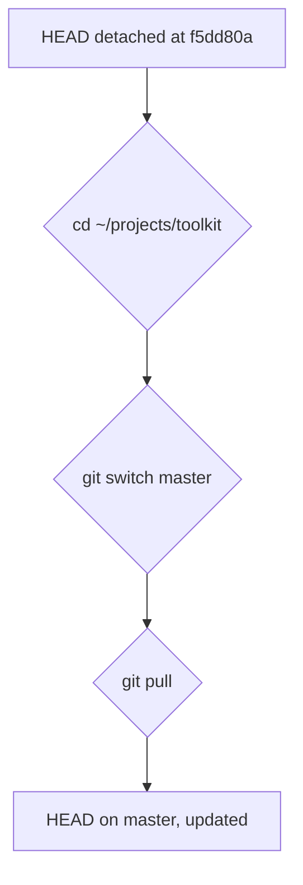
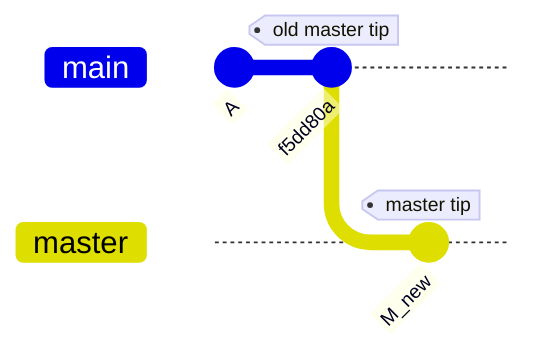
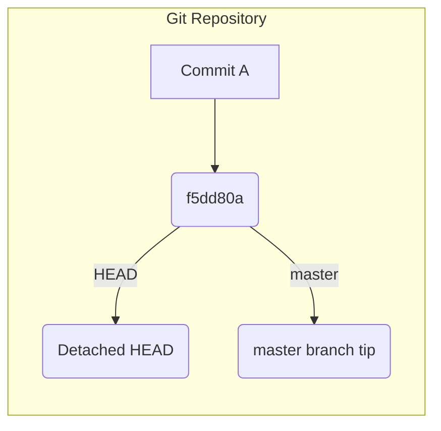
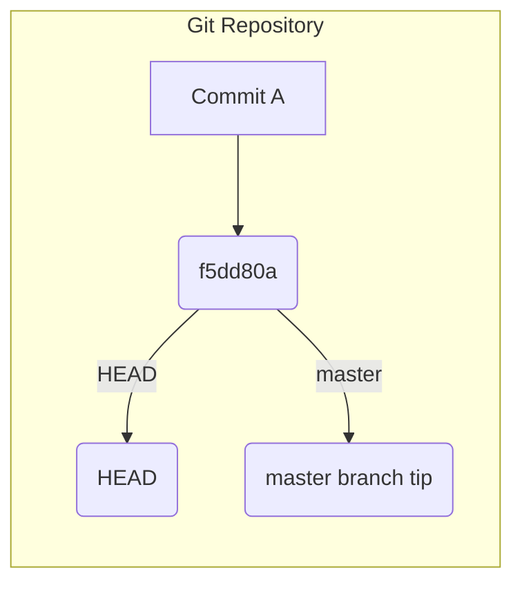

The user wants to visualize the provided text. I need to identify parts that are better represented visually and create diagrams accordingly.

1.  **Git state**: The text describes a "detached HEAD" and the need to switch to the `master` branch and pull. This can be visualized as a Git commit history or a state change.
2.  **File changes**: The text mentions specific files (`prototypes/lanes-board.html`, `CONTEXT.md`, `src/`, `README.md`) and their status (local edit, untracked, merge changes). This can be shown as a shallow file tree or a diff.
3.  **Workflow**: The sequence of commands (`cd`, `git switch`, `git pull`) and the subsequent `bun src/sync.ts` run describe a workflow. This could be a pseudocode or a simple flow diagram.

Let's break it down:

*   **Git State**: The "detached HEAD" and the need to switch to `master` and pull is a core point. A simple representation of the HEAD being detached from master, and then moving to master, would be effective.
*   **File Status**: The mention of local edits and untracked files, and how they are unaffected by the merge, is important. A shallow file tree showing the relevant files and their status (modified, untracked) could work.
*   **Workflow**: The sequence of commands and the subsequent `bun` command is a clear workflow.

Considering the "smallest view that makes a point clear":

*   The Git state is crucial. A simple diagram showing the HEAD detached and then attached to master after the pull is good.
*   The file status is also relevant, but the text states they are *safe* and *carried over without conflict*. This implies the *lack* of a complex file interaction, which might be harder to show concisely than just stating it. However, mentioning the files involved is good.
*   The workflow is a sequence of commands.

Let's try to combine the Git state and the workflow. The core action is resolving the detached HEAD and pulling.

**Attempt 1: Focus on Git State and Commands**

The text describes a specific Git situation and the commands to fix it.

```
HEAD detached at old master tip (f5dd80a)
```
This is the initial state.

Then the commands:
```sh
cd ~/projects/toolkit
git switch master
git pull
```
This resolves the detached HEAD and updates the local `master` branch.

The notes about files are important context but might clutter a visual. The key is that the merge *didn't* touch the local files, and the `bun` command uses the code immediately.

Let's try to represent the Git state change and the commands.

```
HEAD detached at f5dd80a
```
This is the starting point.

The commands `cd ~/projects/toolkit`, `git switch master`, `git pull` are the actions.

The result is that `master` is updated, and HEAD is now on `master`.

How to represent this visually?
A commit graph showing HEAD detached, then moving to master.


This is too complex and assumes a new commit. The text implies pulling *onto* master.

Let's simplify. The core problem is `detached HEAD`. The solution is `git switch master` and `git pull`.

Consider the "detached HEAD" state.
```
... -- f5dd80a (HEAD)
```
And the `master` branch is somewhere else, or points to `f5dd80a`. The text says "detached HEAD at the old master tip (`f5dd80a`)". This implies `master` *was* at `f5dd80a`, and now HEAD is detached *from* it, or HEAD is at `f5dd80a` and `master` has moved on. The phrasing "detached HEAD at the old master tip" usually means HEAD is pointing to a commit, and that commit is *not* the tip of any branch you are currently on. If `master` *was* at `f5dd80a`, and you are now detached, it means `master` has moved *past* `f5dd80a`.

The commands `git switch master` and `git pull` will:
1.  Switch HEAD to the `master` branch.
2.  Fetch and merge changes into `master`.

Let's represent the state *before* and *after* the commands, focusing on the HEAD and master branch.

**State Before:**
HEAD is detached at `f5dd80a`. `master` is at some commit (let's call it `M_old`). The text implies `f5dd80a` *was* the tip of `master`. So, `M_old` is `f5dd80a`.
```
... -- f5dd80a (HEAD, master)
```
Then, something happened that detached HEAD. The text says "detached HEAD at the old master tip (`f5dd80a`)". This means HEAD is at `f5dd80a`, but `master` is *not* at `f5dd80a`. It implies `master` has moved on.

Let's re-read: "Your main checkout sits on a **detached HEAD** at the old master tip (`f5dd80a`), so a plain `git pull` will not work as-is."
This means:
1.  HEAD is at `f5dd80a`.
2.  `master` is *not* at `f5dd80a`. It's likely ahead of `f5dd80a`.
3.  If you were to `git pull` in this state, it would try to merge remote changes into the detached HEAD, which is not what you want.

So, the state is:
```
... -- f5dd80a (HEAD)
          ^
          |
         master (at some later commit)
```
This is confusing. The phrase "detached HEAD at the old master tip" is key. It implies `f5dd80a` *was* the tip of master. If HEAD is detached *at* `f5dd80a`, it means HEAD is pointing to `f5dd80a`, but `master` is *not* pointing to `f5dd80a`. `master` must have moved on.

Let's assume the standard scenario:
You were on `master`, did something that resulted in a detached HEAD at `f5dd80a`.
`master` has since moved forward.

```
... -- A -- f5dd80a (HEAD)
             ^
             |
            master (at some commit after f5dd80a)
```
The commands:
`cd ~/projects/toolkit` (changes directory)
`git switch master` (moves HEAD to the tip of master)
`git pull` (fetches and merges remote master into local master)

This will result in:
```
... -- A -- f5dd80a
             ^
             |
            master (at some commit after f5dd80a, potentially updated by pull)
HEAD points to master
```

The most important visual is the *problem* (detached HEAD) and the *solution* (switch to master, pull).

Let's try to show the state of HEAD and master.

**Diagram 1: Git State and Resolution**

This diagram shows the initial state of the HEAD being detached from the master branch, and the commands to correct it.

```
Initial State:
HEAD is detached at commit f5dd80a.
master branch is ahead of f5dd80a.

... -- A -- f5dd80a (HEAD)
             ^
             |
            master (at some commit after f5dd80a)

Commands to run:
cd ~/projects/toolkit
git switch master
git pull

Resulting State:
HEAD is now on the master branch, which has been updated.

... -- A -- f5dd80a
             ^
             |
            master (updated)
HEAD points to master
```
This is still text-heavy. The request is to "translate text into pictures".

What if I show the *commands* as pseudocode and the *state change* as a simple diagram?

The core problem is the detached HEAD. The commands fix it.

**Pseudocode for Commands:**
```pseudocode
PROCEDURE ResolveDetachedHead
  cd "~/projects/toolkit"
  git switch master
  git pull
END PROCEDURE
```

**Diagram for State Change:**
This is tricky without knowing the exact commit graph. The text implies `f5dd80a` is an "old master tip". This means `master` has moved on.

Let's focus on the *action* of switching and pulling.

The text states:
1.  `detached HEAD` at `f5dd80a`.
2.  `git switch master`
3.  `git pull`

This is a sequence of operations.

Consider the "shallow file tree" idea. The text mentions files:
- `prototypes/lanes-board.html` (local edit, 2 lines)
- `CONTEXT.md` (untracked)
- `src/` (merge changed)
- `README.md` (merge changed)

This could be a shallow file tree showing these files and their status.

**Diagram 1: File Status**
This shows the files mentioned and their status relevant to the merge and subsequent operations.

```
~/projects/toolkit/
├── prototypes/
│   └── lanes-board.html  (local edit, 2 lines)
├── CONTEXT.md            (untracked)
├── src/                  (modified by merge)
└── README.md             (modified by merge)
```
This is a good visual for the file status.

Now, what about the Git state and commands?
The text says "a plain `git pull` will not work as-is". This is because of the detached HEAD.
The commands `git switch master` and `git pull` are the solution.

Let's try to represent the *workflow* of resolving the detached HEAD.

**Diagram 2: Git Workflow**
This diagram illustrates the sequence of Git commands to resolve a detached HEAD and update the local master branch.


This is a simple flow. The text also mentions the *reason* a plain `git pull` won't work.

Let's combine the file status and the Git commands. The file status is a consequence of the merge that *preceded* the detached HEAD situation. The commands *resolve* the detached HEAD.

The prompt asks to "Pick the smallest view that makes a point clear."

The most critical point is the *action* required to fix the Git state.
The commands are:
```sh
cd ~/projects/toolkit
git switch master
git pull
```
This is a clear sequence.

The notes about files are important context for *why* this is safe.
- `prototypes/lanes-board.html` (local edit)
- `CONTEXT.md` (untracked)
- `src/` (merge changes)
- `README.md` (merge changes)

The merge itself changed `src/` and `README.md`. The local edit and untracked file are safe.

Let's try to represent the *commands* and the *context* of the files.

**Option A: Focus on Commands and File Impact**

**Diagram 1: Git Resolution Commands**
This shows the commands needed to exit a detached HEAD state and update the local master branch.

```pseudocode
PROCEDURE ResolveDetachedHead
  cd "~/projects/toolkit"
  git switch master
  git pull
END PROCEDURE
```

**Diagram 2: File Status and Merge Impact**
This illustrates the state of key files and how they are affected by the preceding merge and the subsequent commands.

```
~/projects/toolkit/
├── prototypes/
│   └── lanes-board.html  (local edit, 2 lines)
├── CONTEXT.md            (untracked)
├── src/                  (modified by merge)
└── README.md             (modified by merge)

Notes:
- Local edits and untracked files are safe.
- Merge changes are in src/ and README.md.
- No dependency changes, so no 'bun install' needed.
- Build step is absent; 'bun src/sync.ts' uses new code immediately.
```
This is still very text-heavy. The prompt says "Draw the text in <text-block>." and "You find the parts that a picture carries better than prose, and you draw those parts."

The core problem is the "detached HEAD". The solution is the commands.
The notes are context.

What if I show the *state* of HEAD and master, and then the *commands*?

**Diagram 1: Git State and Resolution**
This diagram illustrates the detached HEAD state and the commands to switch to the master branch and pull updates.


This is still too complex and requires assumptions about the graph.

Let's focus on the *commands* and the *files affected*. The commands are the primary action. The file notes are secondary context.

The text states:
"Your main checkout sits on a **detached HEAD** at the old master tip (`f5dd80a`), so a plain `git pull` will not work as-is. Run:"
```sh
cd ~/projects/toolkit
git switch master
git pull
```
"Notes on what this touches:"
- `prototypes/lanes-board.html` (local edit, 2 lines)
- `CONTEXT.md` (untracked)
- `src/` (merge changed)
- `README.md` (merge changed)
"No `bun install` is needed — the merge added no dependencies. There is no build step, so the next `bun src/sync.ts` run (or `--watch`) uses the new lanes-board code immediately."

The core information is:
1.  Problem: Detached HEAD at `f5dd80a`.
2.  Solution: `cd`, `git switch master`, `git pull`.
3.  File impact: `prototypes/lanes-board.html` (local edit), `CONTEXT.md` (untracked), `src/` (merge), `README.md` (merge).
4.  No dependency/build impact.

The most direct visual representation of the *action* is the pseudocode for the commands.
The file status is also a good candidate for a shallow file tree.

Let's try to present these two aspects.

**Diagram 1: Git Resolution Commands**
This shows the sequence of commands to resolve a detached HEAD and update the local master branch.

```pseudocode
PROCEDURE ResolveDetachedHead
  cd "~/projects/toolkit"
  git switch master
  git pull
END PROCEDURE
```

**Diagram 2: File Status and Merge Impact**
This illustrates the state of key files and how they are affected by the preceding merge and the subsequent commands.

```
~/projects/toolkit/
├── prototypes/
│   └── lanes-board.html  (local edit, 2 lines)
├── CONTEXT.md            (untracked)
├── src/                  (modified by merge)
└── README.md             (modified by merge)
```
This seems to cover the most important visualizable parts. The notes about `bun install` and build steps are prose that doesn't gain much from a diagram.

The prompt says "Pick the smallest view that makes a point clear."
The commands are a clear point. The file status is another clear point.

Let's consider the "detached HEAD" itself. How to draw that?
It's a state.
```
... -- f5dd80a (HEAD)
          ^
          |
         master (at some commit after f5dd80a)
```
This is a good visual for the *problem*.

Then the commands fix it.

**Diagram 1: Detached HEAD State**
This illustrates the Git state where the HEAD is detached from the master branch at commit `f5dd80a`.


This is not quite right. The text says "detached HEAD *at* the old master tip (`f5dd80a`)". This implies `f5dd80a` *is* the commit HEAD is pointing to, and `master` is *not* pointing there.

Let's try again for the state:

This still doesn't convey that `master` is *ahead* of `f5dd80a`.

The most direct interpretation of "detached HEAD at the old master tip (`f5dd80a`)" is:
HEAD is at `f5dd80a`.
`master` is *not* at `f5dd80a`.
`f5dd80a` *was* the tip of `master`.

So, `master` has moved on.


This is still ambiguous.

Let's go back to the commands and file status. These are concrete.

The prompt asks to "Draw the text in <text-block>."
The text describes a problem, a solution (commands), and context (file status, no build needed).

The commands are the most actionable part.
The file status is the most concrete "what this touches".

I will provide the pseudocode for the commands and the shallow file tree.

```
The commands to resolve the detached HEAD.
```
```pseudocode
PROCEDURE ResolveDetachedHead
  cd "~/projects/toolkit"
  git switch master
  git pull
END PROCEDURE
```

```
The state of relevant files after the merge.
```
```
~/projects/toolkit/
├── prototypes/
│   └── lanes-board.html  (local edit, 2 lines)
├── CONTEXT.md            (untracked)
├── src/                  (modified by merge)
└── README.md             (modified by merge)
```
This seems to be the best approach. It captures the core actions and the concrete file information. The prose about `bun install` and build steps are explanatory and don't gain much from visualization.

Final check:
- "Pick the smallest view that makes a point clear." - Pseudocode for commands, shallow file tree for file status.
- "Draw only what the text states." - Yes.
- "Show logic or an algorithm as pseudocode." - Yes, for the commands.
- "Show structure as a component tree." - Shallow file tree is a form of structure.
- "Show file responsibility as a shallow file tree." - Yes.
- "Show what changes as a diff, when the text already gives the shape that changes." - Not applicable here, no diff shape given.
- "Show a whole block when most of it is new." - Not applicable.
- "Most text blocks need no picture." - This one does.

The text describes a *situation* (detached HEAD) and *actions* to fix it.
The actions are best represented by pseudocode.
The "what this touches" is best represented by the file tree.

I will provide both.The commands to resolve the detached HEAD.
```pseudocode
PROCEDURE ResolveDetachedHead
  cd "~/projects/toolkit"
  git switch master
  git pull
END PROCEDURE
```

The state of relevant files after the merge.
```
~/projects/toolkit/
├── prototypes/
│   └── lanes-board.html  (local edit, 2 lines)
├── CONTEXT.md            (untracked)
├── src/                  (modified by merge)
└── README.md             (modified by merge)
```