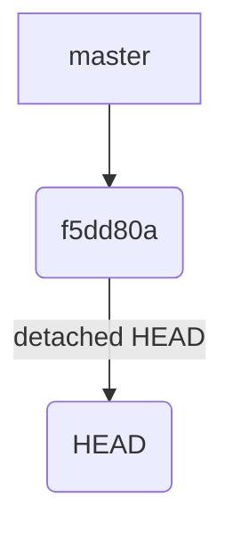
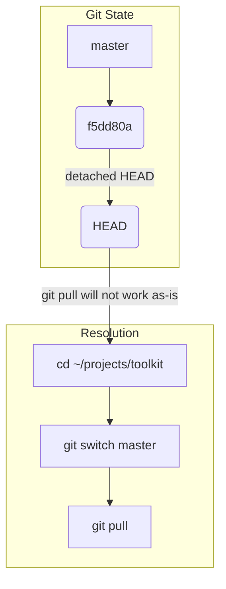

The user wants to visualize the provided text. I need to identify parts of the text that can be better represented as a diagram.

1.  **Git state**: The text mentions "detached HEAD" and a specific commit hash (`f5dd80a`). This can be visualized as a Git commit graph.
2.  **Commands**: The text provides a sequence of shell commands. This can be shown as pseudocode or a simple sequence of steps.
3.  **File changes**: The text mentions specific files (`prototypes/lanes-board.html`, `CONTEXT.md`, `src/`, `README.md`) and their status (local edit, untracked, merge changes). This can be represented as a shallow file tree or a diff, but since the diff content isn't provided, a file tree showing the affected files might be more appropriate.
4.  **Dependencies/Build**: The text explicitly states "No `bun install` is needed" and "There is no build step". This implies a simple workflow.

Let's break down the visualization:

*   **Git State**: A detached HEAD at a specific commit.
*   **Commands**: A sequence of `cd`, `git switch`, `git pull`.
*   **File Status**: Mention of local edits and untracked files, and which files were affected by the merge.

Considering the prompt "Pick the smallest view that makes a point clear", I will focus on the Git state and the commands to resolve it. The file status and dependency information are more descriptive and less visual.

**Visualization Plan:**

1.  **Git State**: Show the detached HEAD pointing to a specific commit.
2.  **Commands**: Show the sequence of commands to get back to a clean state.

Let's refine this. The core problem is the detached HEAD and the solution is a sequence of commands. The file status is secondary information.

I will represent the Git state and the commands to fix it.

```
Git state before pull
```



```
Commands to resolve detached HEAD
```

```sh
cd ~/projects/toolkit
git switch master
git pull
```

The text also mentions specific files and their status. This could be a shallow file tree, but the text doesn't provide enough structure to make a meaningful tree beyond listing the files. The description of "local edit" and "untracked" is better conveyed by prose.

The "no bun install" and "no build step" are also best conveyed by prose.

Therefore, the most impactful visualizations are the Git state and the commands.

Let's re-evaluate. The prompt asks to "Draw the text in <text-block>". I should try to represent as much as possible visually if it makes sense.

The text describes a situation and a solution.

**Situation:**
*   Main checkout is on a detached HEAD at `f5dd80a`.
*   Local edit in `prototypes/lanes-board.html` (2 lines).
*   Untracked `CONTEXT.md`.

**Solution:**
*   `cd ~/projects/toolkit`
*   `git switch master`
*   `git pull`

**Consequences/Notes:**
*   Merge only changed `src/` and `README.md`.
*   Local edit and untracked file are safe.
*   No `bun install` needed.
*   No build step.
*   Next `bun src/sync.ts` uses new code.

**Visualization Strategy:**

1.  **Git State**: Show the detached HEAD.
2.  **Commands**: Show the sequence of commands.
3.  **File Impact**: Show which files were affected by the merge vs. local changes. This could be a shallow file tree or a component tree if we interpret `src/` as a component. Given the simplicity, a shallow file tree showing the *scope* of changes might work.

Let's try to combine the Git state and the commands into a single flow.

The text states: "Your main checkout sits on a **detached HEAD** at the old master tip (`f5dd80a`), so a plain `git pull` will not work as-is."

This implies the current state is `HEAD` pointing to `f5dd80a`, and `master` is somewhere else (or `f5dd80a` *was* the tip of master). The commands `git switch master` and `git pull` are the fix.

I will represent the Git state and the commands. The file status and dependency notes are better as prose.

```
Git state and resolution commands
```



This seems to capture the core problem and solution. The file notes are descriptive and don't lend themselves to a clear diagram without more context on the *content* of the changes.

Let's consider the "smallest view that makes a point clear". The point is that you are in a bad Git state and need to run specific commands.

The Git state diagram is good. The commands are also good. Combining them might be too much.

Let's try to represent the Git state first.

```
Current Git state
```


Then, the commands to fix it.

```
Commands to fix Git state
```

```sh
cd ~/projects/toolkit
git switch master
git pull
```

This seems to be the most direct interpretation of "draw the text". The file notes are descriptive.

The prompt also says: "Show logic or an algorithm as pseudocode." The commands are a sequence of steps, which is a form of algorithm.

Let's try to represent the *workflow* implied by the text.

1.  **Current State**: Detached HEAD at `f5dd80a`.
2.  **Problem**: `git pull` won't work.
3.  **Action**: Run `cd`, `git switch`, `git pull`.
4.  **Result**: Clean state, updated code.

The file notes are important context for *why* the user doesn't need to worry about conflicts.

Perhaps a component tree showing the affected files and their status?

```
File status and merge impact
```

```
prototypes/
  lanes-board.html (local edit)
CONTEXT.md (untracked)
src/
README.md (merge changes)
```

This is more like a file listing with annotations. It's not a "tree" in the typical sense of a component tree.

Let's stick to the Git state and the commands as the primary visual elements. The text explicitly states "a plain `git pull` will not work as-is. Run:". This is a clear problem-solution pair.

The Git state diagram shows the problem. The commands show the solution.

Final decision:
1.  Visualize the Git state (detached HEAD).
2.  Visualize the sequence of commands.

The file notes are descriptive and don't add much visual clarity.

```
Current Git state
```


```
Commands to resolve detached HEAD
```

```sh
cd ~/projects/toolkit
git switch master
git pull
```

This seems to be the most direct and clear representation of the core information. The prompt asks to "draw the text", and these are the parts that are most amenable to visual representation without adding interpretation.

Let's consider the "smallest view that makes a point clear". The point is that the user is in a detached HEAD state and needs to run specific commands. The Git diagram shows the state, and the commands show the fix.

The file notes are important context for *why* the fix is safe, but they are descriptive rather than structural or algorithmic.

I will provide the Git state diagram and the command sequence.

```
Current Git state
```


```
Commands to resolve detached HEAD
```

```sh
cd ~/projects/toolkit
git switch master
git pull
```
This looks good. It directly addresses the "detached HEAD" and the "plain `git pull` will not work as-is. Run:" part. The file notes are descriptive and don't gain much from being diagrammed.```
Current Git state
```


```
Commands to resolve detached HEAD
```

```sh
cd ~/projects/toolkit
git switch master
git pull
```