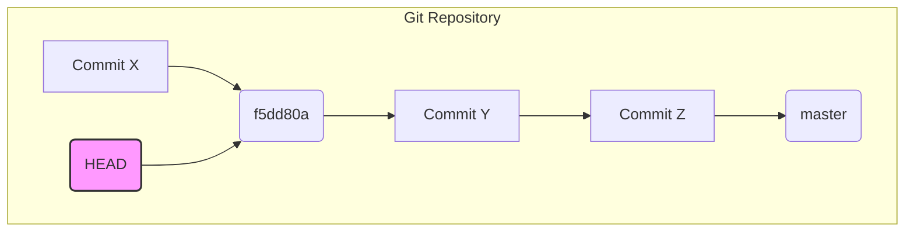

Your main checkout is on a detached HEAD at the old master tip (`f5dd80a`). A plain `git pull` will not work.

The current Git state is a detached HEAD at an old master tip.



Run these commands to switch to master and pull updates.

```pseudocode
cd ~/projects/toolkit
git switch master
git pull
```

You have a small local edit in `prototypes/lanes-board.html` and an untracked `CONTEXT.md`. These are safe. The merge only changed `src/` and `README.md`. The switch and pull will carry your changes over without conflict.

No `bun install` is needed because the merge added no dependencies. There is no build step. Your next `bun src/sync.ts` run will use the new lanes-board code immediately.

After that, a sync pass against a live map gives you the first real `lanes #<n>` tab. If you type `! cd ~/projects/toolkit && git switch master && git pull` in the prompt, the update runs right here and I can see the result.
If you type `! cd ~/projects/toolkit && git switch master && git pull` in the prompt, the update runs right here and I can see the result.