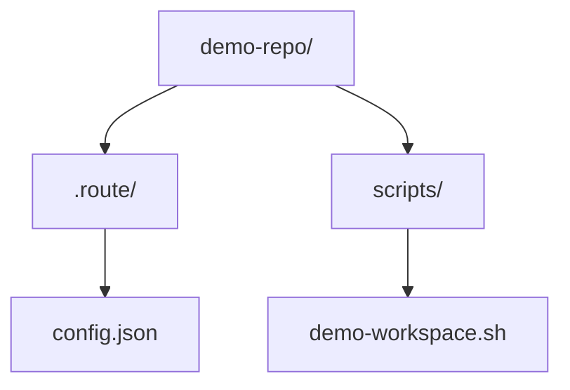

The text describes a complex workflow with multiple components and states. A diagram illustrating the overall flow and the states of different elements would be most effective.

Here's a breakdown of the visual elements I'll create:

1.  **Component Tree**: To show the hierarchical structure of the `DEMO` group and its rows.
2.  **Call Tree**: To represent the "Your stage path" as a sequence of actions and jumps.
3.  **Pseudocode**: To illustrate the "Pre-flight" and "On finish" steps.
4.  **Shallow File Tree**: To show the `demo-repo` structure and the `scripts/demo-workspace.sh` file.
5.  **Diff**: To show the initial state of `config.json` and its state after the "Pre-flight" step.

```mermaid
componentDiagram
    direction LR
    component "DEMO Group" {
        component "DEMO 2" as DEMO2
        component "DEMO 3" as DEMO3
        DEMO2 -- DEMO3
        note right of DEMO3 "Anchor auto-made, invisible"
    }

    component "Row 1 (route-cli)" {
        component "Pane 1 (browser)" as P1B
        component "Pane 2 (browser)" as P2B
        component "Pane 3 (browser)" as P3B
        component "Pane 4 (terminal)" as P4T
        component "Pane 5 (terminal)" as P5T
        component "Pane 6 (terminal)" as P6T
        component "Pane 7 (terminal)" as P7T
        component "Pane 8 (browser)" as P8B
        component "Pane 9 (browser)" as P9B
    }

    component "Row 2 (grill-ui)" {
        component "Left Pane (42%)" as L42
        component "Right Pane (58%)" as R58
    }

    DEMO2 -- "Row 1 (route-cli)"
    DEMO3 -- "Row 2 (grill-ui)"

    P1B -- P2B -- P3B -- P4T -- P5T -- P6T -- P7T -- P8B -- P9B
    L42 -- R58

    note left of P1B "docs site"
    note left of P2B "docs.example.dev /route"
    note left of P3B "an-author SKILL.md"
    note left of P4T "`route` pre-run"
    note left of P5T "`route --help` then `route ticket-skill add`"
    note left of P6T "`cat .route/config.json`"
    note left of P7T "`cat examples.md | glow` pre-run"
    note left of P8B "axi.md"
    note left of P9B "github acme/route-cli"

    note left of L42 "map #45, lanes #45, claude --resume"
    note left of R58 "artifact e5f6a7b8-..., grill-design SKILL.md"
```

The "DEMO Group" contains two components, "DEMO 2" and "DEMO 3", which are on collision. An anchor is auto-made and invisible. "DEMO 2" is associated with "Row 1 (route-cli)" and "DEMO 3" is associated with "Row 2 (grill-ui)". "Row 1" consists of nine panes, each with a specific type and content. "Row 2" has two panes, left and right, with their respective content and selected tabs.

```mermaid
callTree
    title Your Stage Path
    root(Start)
    root --> docs_site
    docs_site --> docs_site_route
    docs_site_route --> an_author
    an_author --> route_before["route (before)"]
    route_before --> jump_to_grill_ui["jump to grill-ui"]
    jump_to_grill_ui --> back_to_row1["back to row 1"]
    back_to_row1 --> tab5_add["tab 5 add"]
    tab5_add --> tab6_config["tab 6 config"]
    tab6_config --> back_to_tab4_rerun["back to tab 4, re-run (after)"]
    back_to_tab4_rerun --> examples
    examples --> axi_md
    axi_md --> github
```

The stage path begins with the "docs site", progresses through "docs.example.dev /route", then "an-author SKILL.md". It reaches the `route` command *before* a significant jump to "grill-ui". After returning to row 1, the path involves actions in "tab 5 add" and "tab 6 config", followed by a return to "tab 4, re-run" *after* the previous steps. Finally, it moves through "examples", "axi.md", and "github".

```mermaid
flowchart TD
    subgraph Pre-flight
        A[Write {"ticketSkills": {}} to .route/config.json]
    end

    subgraph On finish
        B[Focus row 1, tab 1]
    end
```

The "Pre-flight" step involves writing a specific JSON object to `.route/config.json`. The "On finish" step focuses the user interface on row 1, tab 1.



The `demo-repo` directory contains a `.route` directory with `config.json` inside, and a `scripts` directory containing the executable `demo-workspace.sh` file.

```diff
--- a/.route/config.json
+++ b/.route/config.json
@@ -1 +1 @@
-{}
+{"ticketSkills": {}}
```

Initially, `.route/config.json` is empty. After the "Pre-flight" step, it contains `{"ticketSkills": {}}`.