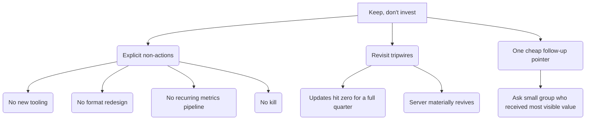

supplements - the conclusion is actionable

```mermaid
graph TD
    A[Keep, don't invest] --> B(Explicit non-actions);
    A --> C(Revisit tripwires);
    A --> D(One cheap follow-up pointer);
    B --> B1(No new tooling);
    B --> B2(No format redesign);
    B --> B3(No recurring metrics pipeline);
    B --> B4(No kill);
    C --> C1(Updates hit zero for a full quarter);
    C --> C2(Server materially revives);
    D --> D1(Ask small group who received most visible value);
```