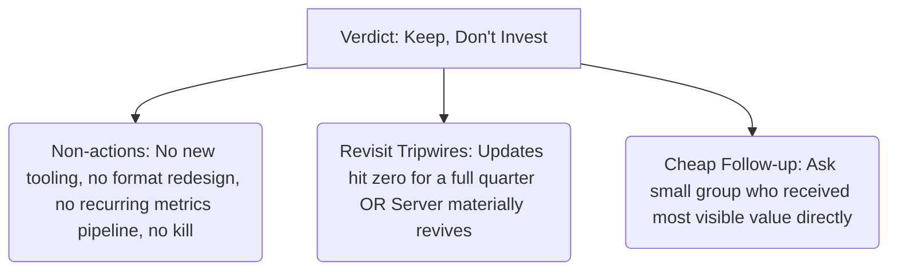

The tiny conclusion hands the reader actionable items.

```mermaid
graph TD
    A[Verdict: Keep, Don't Invest] --> B(Non-actions: No new tooling, no format redesign, no recurring metrics pipeline, no kill);
    A --> C(Revisit Tripwires: Updates hit zero for a full quarter OR Server materially revives);
    A --> D(Cheap Follow-up: Ask small group who received most visible value directly);
```