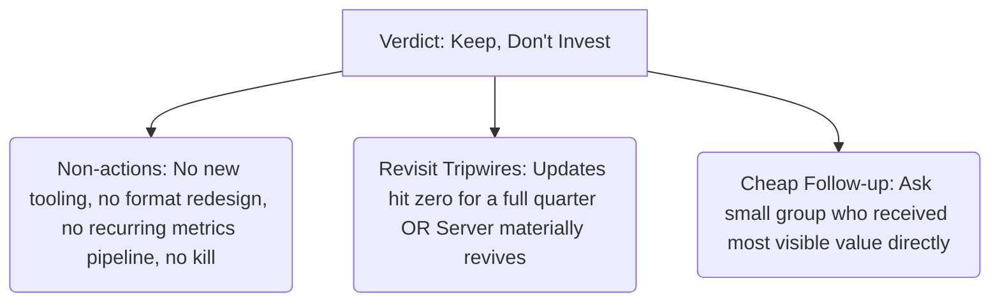

I decided: **keep, don't invest.**

"Kill" blames a server-wide failure on its strongest part. This is the most dangerous wrong answer. It risks a false negative. "Improve" wastes time on a supply issue that no format change can fix. "Keep" costs nothing. It keeps the option open if the server recovers.

---

**Q3. What small advice makes "keep, don't invest" something the reader can act on?**

The ticket notes that "kill" and "keep" are easy to write but hard to do. The conclusion must be short. It cannot include a plan to carry out the decision. The plan is outside the scope of this map anyway. So, what is the least amount of information needed to make the conclusion a *decision* and not just a shrug?

I suggest three short things:

1.  **Say what not to do.** "Don't invest" means: no new tools, no redesigning the format, no recurring metrics pipeline (this is already out of scope), and no killing the server.
2.  **Set conditions to review.** These are the triggers that will make us reconsider the decision. "Keep" does not mean "never look again." Specifically, review if updates stop for a full quarter (meaning the server died on its own). Also, review if the server significantly recovers (then it might be worth pricing an "improve" strategy).
3.  **Point to one cheap next step.** The data cannot see private messages, introductions, or offline value. But it *names* the small group that got the most visible value. The conclusion should suggest asking them directly. This is a cheap way to reduce the risk of a false negative. This is only a pointer. Actually doing it is a new task, and the map ruled out surveys for this study.

What would you add, remove, or change about this plan?