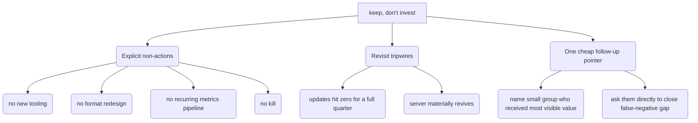

The verdict is: **keep, don't invest.**

A server-wide collapse is wrongly blamed on its most stable part. This is the most dangerous wrong answer because of the risk of false negatives. "Improve" wastes effort on a supply problem that no change in format can fix. "Keep" costs nothing and keeps the option open if the server recovers.

<diagrams>
The conclusion hands the reader actionable items by specifying explicit non-actions, revisit tripwires, and a cheap follow-up pointer.

</diagrams>

**Q3. What does the small conclusion give the reader so "keep, don't invest" is actionable?**

The ticket notes that "kill" and "keep" are easy to write but hard to act on. Since the conclusion must be small, it cannot include a plan to carry out the verdict. The map also states that carrying out the verdict is outside the scope of this study. So, the question is: what is the smallest amount of information needed to make the verdict a *decision* instead of a non-answer?

Here are three short items:

1.  **Explicit non-actions**: These are things "don't invest" rules out. Do not add new tools. Do not redesign the format. Do not set up a recurring metrics pipeline (this is already out of scope). Do not kill the server.
2.  **Revisit tripwires**: These are the conditions that will make us reconsider the decision. "Keep" does not mean "never look again." Specifically, reconsider if updates stop for a full quarter (this means the stable part failed on its own). Also, reconsider if the server significantly recovers (then "improve" might be worth the cost).
3.  **One cheap follow-up pointer**: The data cannot see direct messages, introductions, or offline value. However, it *does* name the small group that received most of the visible value. The conclusion should note that asking them directly is a cheap way to reduce the risk of false negatives. This is only a pointer; actually doing it is a new effort, and the map ruled out surveys for this study.

Is there anything you would add, remove, or change about this set of items?