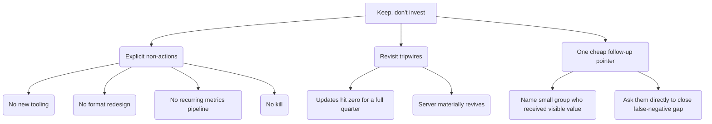

The conclusion hands the reader actionable items by specifying explicit non-actions, revisit tripwires, and a cheap follow-up pointer.

```mermaid
graph TD
    A[Keep, don't invest] --> B(Explicit non-actions);
    A --> C(Revisit tripwires);
    A --> D(One cheap follow-up pointer);
    B --> B1(No new tooling);
    B --> B2(No format redesign);
    B --> B3(No recurring metrics pipeline);
    B --> B4(No kill);
    C --> C1(Updates hit zero for a full quarter);
    C --> C2(Server materially revives);
    D --> D1(Name small group who received visible value);
    D --> D2(Ask them directly to close false-negative gap);
```