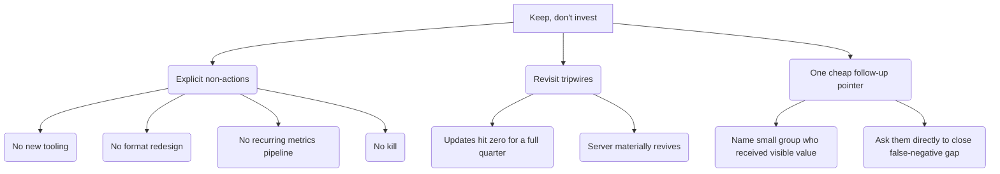

The verdict is: **keep, don't invest.**

"Kill" blames a server-wide failure on its most stable part. This is the most dangerous wrong answer because it risks a false negative. "Improve" wastes effort on a problem that format changes cannot fix. "Keep" costs nothing and keeps the option open if the server recovers.

<diagrams>
The conclusion gives the reader actionable items by listing specific non-actions, conditions to re-evaluate, and a simple next step.

</diagrams>

**Q3. What does the brief conclusion give the reader so "keep, don't invest" is actionable?**

The ticket notes that "kill" or "keep" decisions are "easy to write and hard to act on." Since you want a short conclusion, it cannot include a plan for how to do it. The plan is also outside the scope of the map. So, the question is: what is the smallest amount of information needed to make the verdict a *decision* instead of a non-answer?

I suggest three short items:

1.  **Explicit non-actions** — what "don't invest" means you should *not* do: do not build new tools, do not redesign the format, do not set up a recurring metrics pipeline (this is already out of scope), and do not "kill" the server.
2.  **Revisit tripwires** — the conditions that will make you reconsider the decision, so "keep" does not mean "ignore this forever." Specifically: reconsider if updates drop to zero for three months straight (meaning the server failed on its own), or if the server shows significant signs of recovery (then it might be worth the cost to "improve" it).
3.  **One cheap follow-up pointer** — the data cannot see direct messages, introductions, or offline value. However, it *does* show the small group that got most of the visible value. The conclusion should state that asking them directly is the cheap way to reduce the risk of a false negative. This is just a pointer — actually doing it is a new task, and the map ruled out surveys for this study.

Is there anything you would add, remove, or change about this list of items?