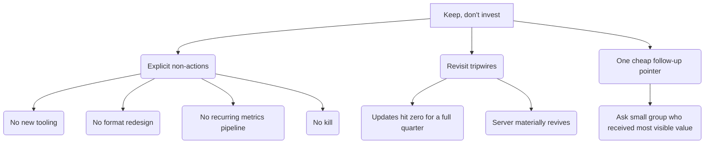

My decision is: **keep, don't invest.**

Killing the service blames a server-wide collapse on its most stable part. This is the most dangerous wrong answer because of the risk of false negatives. Improving the service spends effort on a problem with the supply that no change to the format can fix. Keeping the service costs nothing. It also keeps the option open if the server recovers.

---

**Q3. How does the short conclusion make "keep, don't invest" something the reader can act on?**

The ticket notes that "kill" and "keep" are "easy to write and hard to act on." Because you want the conclusion to be short, it cannot include a plan for how to do it. Also, the plan for how to act on the verdict is not part of this map. So, the question is: what is the smallest amount of information needed to make the verdict a *decision* instead of a non-answer?

I suggest three short items:

1.  **Explicit non-actions** — what "don't invest" means you should not do: do not add new tools, do not redesign the format, do not set up a recurring metrics pipeline (this is already not part of this map), and do not kill the service.
2.  **Revisit tripwires** — these are the conditions that will make us look at the question again. This means "keep" does not mean "never check again." Specifically: look again if updates stop for a full quarter (meaning the stable part failed on its own), or if the server starts to recover in a meaningful way (then it would be worth the cost to figure out how to improve it).
3.  **One cheap follow-up pointer** — the data cannot see direct messages, introductions, or value found offline. However, it *names* the small group that got most of the visible value. The conclusion notes that asking them directly is a cheap way to reduce the risk of false negatives. This is only a pointer — actually doing it is a new task, and the map ruled out surveys for this study.

Is there anything you would add, remove, or is this the right amount of information?

supplements - the conclusion is actionable

