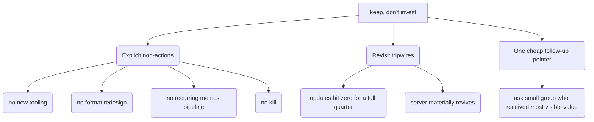

The verdict is: **keep, don't invest.**

A server-wide collapse is wrongly blamed on its most stable part. This is the most dangerous wrong answer because it risks a false negative. "Improve" wastes effort on a supply problem that no format change can fix. "Keep" costs nothing and keeps the option open if the server recovers.

<diagrams>
The tiny conclusion hands the reader actionable items.

</diagrams>

**Q3. What does the small conclusion give the reader so "keep, don't invest" can be acted on?**

The ticket notes that "kill" and "keep" are easy to write but hard to act on. Since the conclusion must be small, it cannot include a plan for how to do it. The plan is also outside the scope of the map. So, the question is: what is the least amount of information needed to make the verdict a *decision* instead of a non-answer?

I recommend three short things:

1.  **State what not to do.** "Don't invest" means: do not add new tools, do not redesign the format, do not set up a recurring metrics pipeline (this is already out of scope), and do not kill the server.
2.  **Set conditions to review.** These are the conditions that will make us reconsider the decision. "Keep" does not mean "never check again." Specifically, review if updates stop for a full quarter (meaning the stable part failed on its own), or if the server significantly recovers (then it might be worth pricing an "improve" strategy).
3.  **Point to one cheap next step.** The data cannot see private messages, introductions, or offline value. However, it *does* name the small group that got most of the visible value. The conclusion should note that asking them directly is a cheap way to reduce the risk of a false negative. This is only a pointer; actually doing it is a new task, and the map ruled out surveys for this study.

Is there anything you would add, remove, or change about this set of actions?